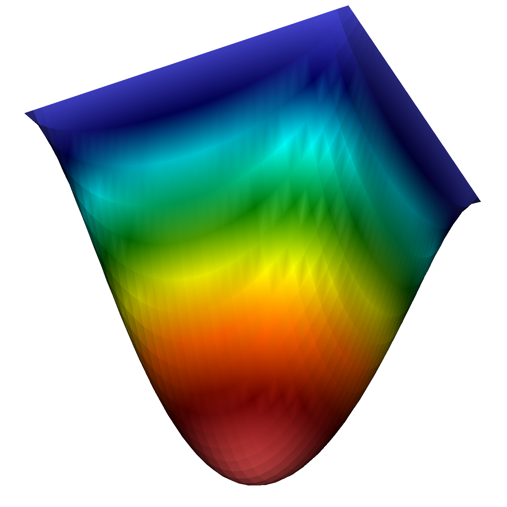

# deal.II Crash Course of the 10th deal.II Users and Developers Workshop

This repository contains the source code for the [deal.II](https://www.dealii.org) crash course of the [10th deal.II Users and Developers Workshop](https://www.dealii.org/workshop-2023/). 

The course is structured in two sessions. In the first session, the basic layout of a deal.II program will be covered by solving a stationary Poisson's problem. The second session will be dedicated to the solution of a time-dependent problem. More concrete, a linear Heat equation.

In both case, a code skeleton is provided which should be filled in a gap text manner. The sessions' folders can be found by their names. In addition, each session folder contains a solution folder which includes a working code solution.

## Run Code

1. `cmake -DDEAL_II_DIR=PATH2DEALII .`: build 
2. `make release`: switch from debug to release mode
3. `make`: compile code
4. `make run`: run code

## Session 1 
Session 1 aims to solve Poisson's problem and is oriented on [step-3](https://www.dealii.org/current/doxygen/deal.II/step_3.html) of the deal.II tutorial program. 

### Poisson's problem
Let $\Omega\subset\mathbb{R}^d$ and dimension $d=1,2,3$. Find $u:\bar{\Omega}\to\mathbb{R}$ such that

$$
\begin{aligned}
-\Delta u &= 1 &&\quad\text{in } \Omega\\
u &= 0 &&\quad\text{on } \partial\Omega
\end{aligned}
$$

Exemplary solutions for $d=1,2$ are sketched or shown below.

    
    

#### Exercise
The missing gaps are marked by `/* MISSING CODE /*` comments. The following steps must be done to complete the code:

1. Complete `Poisson::run()`.
   - This method is used as a central place to call the other methods of the class to solve the problem.
2. Complete `Poisson::make_grid()` by generating the mesh.
3. Complete `Poisson::assemble_system()`.
   1. Get the `FEValues<2> fe_values`.
   2. Reset the local cell's contributions.
   3. Assemble system matrix contributions.
   4. Assemble the rhs contribution. 
   5. Transfer the local elements to the global matrix.
   6. Transfer the local elements to the global rhs.
   7. Set Dirichlet boundary conditions.

#### Bonus
For further Interaction with the code, there are two bonus exercises that could be done to extend the code. These are marked in the code by `/* BONUS */`.

1. Try out and replace the homogeneous Dirichlet BC by non-zero BC.
2. Investigate the solution on successively refined meshes.

## Session 2
### Heat equation

Find $u:=u(x,t):\bar{\Omega}\times \bar{I}\to \mathbb{R}$ such that

$$
\begin{aligned}
\rho \partial_t u - \nabla\cdot (\alpha(x) \nabla u) &= f &&\quad\text{in } \Omega\times
I,\\
u &= u_D &&\quad\text{on } \partial\Omega \times (0,T),\\
u(0) &= u_0 &&\quad\text{in } \Omega\times \{t=0\},
\end{aligned}
$$

where $f:\Omega\times I\to \mathbb{R}$ and $u_0:\Omega\to\mathbb{R}$ and $\alpha(x)>0$ and $\rho>0$ are material parameters, and $u_D\geq 0$ is a Dirichlet boundary condition. As an example, $u_0$ is the initial temperature and $a$ is the wall temperature, and $f$ is some heat source.

In this exercise, let $\Omega = [0,\pi]^2$ and $I = [0,20]$ and

- $u_D = 0$,
- $u_0 = \sin(x_1)\sin(x_2)$,
- $f = 0$,
- $\alpha(x) = 1$.

#### Exercise
The missing gaps are marked by `/* MISSING CODE /*` comments. The following steps must be done to complete the code:

1. In `main`: Initialize a 2D instance of the `Step_Heat` class and start the solution process.
2. In `run`: Call the grid generation and the system setup. 
3. In `system_setup`:
   1. Create the sparsity pattern. 
   2. Initialize the rhs and solutions vectors. 
      - Note, that a vector to store the old solution is required.
4. In `InitialValues<dim>::value`: Add the initial condition for the solution.
5. In `run`:
   1. Call the assemble of the system for each new time step solve.
   2. Solve the LES.
   3. Add the stopping criterion for the time step loop.
6. In `assemble_system`:
   1. Add the `fe_values`.
   2. Add mass matrix contribution to `cell_matrix`.
   3. Add stiffness matrix contribution to `cell_matrix`.
   4. Add rhs values contributions to `cell_vector`.
   5. Add old time step solution contributions to `cell_vector`.

#### Bonus
For further Interaction with the code, there are two bonus exercises that could be done to extend the code. These are marked in the code by `/* BONUS 1 */` and `/* BONUS 2 */`, respectively.

1. The code contains the possibility to choose a space-dependent $\alpha(x) \leq 0$. Try to simulate the heat equation with two different heat coefficients.
   1. In `Coefficient<dim>::value`: Return a space dependent heat coefficient.
   2. In `assemble_system`: Add the `const Coefficient<dim> coefficient` and its contributions in the assembly of `cell_matrix`.
2. Previously, we choose a homogenous RHS. Try to extend this top a non-zero RHS.